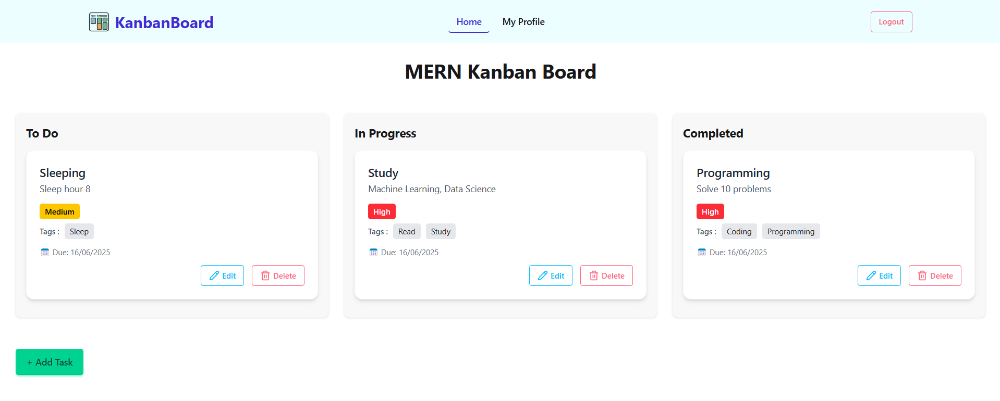

<h1 align="center">🗂️ MERN Kanban Task Manager</h1>
<p align="center">
  An interactive and modern **Kanban Board Web App** built with the **MERN stack**, featuring real-time task management, drag-and-drop, user authentication, profile editing, and more.
</p>

<p align="center">
  
  
  
</p>

---

## 🚀 Live Demo

👉 [Click here to try it live](https://kanban-board-task.web.app/)

---

## 📌 Features

- 🧾 User registration & login with Firebase Auth
- 🧠 Intuitive Kanban board UI (`To Do`, `In Progress`, `Completed`)
- 🪄 Drag & drop tasks with real-time status update
- 📝 Add, edit, delete tasks with title, description, due date, priority, and tags
- 🧍‍♂️ User-specific task control (only update your own tasks)
- 📸 Profile page with avatar, name, and email (editable)
- 🔐 Firebase Token-secured backend API routes
- 🌈 Fully responsive & styled with Tailwind CSS + DaisyUI

---

## 🛠️ Tech Stack

| Frontend            | Backend                | Database         | Auth & Hosting      |
|---------------------|------------------------|------------------|---------------------|
| React + Vite        | Node.js + Express      | MongoDB (Atlas)  | Firebase Auth + Firebase Hosting |
| DaisyUI + Tailwind  | Firebase Token Verify  | Mongoose         | Firebase + Vercel |

---

## 🧩 Frontend Dependencies & Usage

| Package Name         | Usage Summary |
|----------------------|---------------|
| **@hello-pangea/dnd** | For drag-and-drop between Kanban columns |
| **axios**             | For making HTTP requests to the backend |
| **lucide-react**      | Modern and customizable icon library |
| **react-router-dom**  | Handles page navigation and routing |
| **sweetalert2**       | For beautiful alert modals (success, error, confirm) |

---

## 📡 API Endpoints

All API routes are prefixed with:  
`http://localhost:5000`

> 🔐 Routes marked with `🔒` require firebase authentication in the `Authorization` header as a Bearer token.

---

🔹 **Axios Interceptors**
**  
Request Body:
```json
{ "email": "user@example.com" }
```
🔹 **POST /tasks**
**  
Request Body:
```json
{
  "title": "New Task",
  "description": "Optional details",
  "dueDate": "2025-06-15",
  "priority": "High",
  "tags": ["frontend", "urgent"]
}
```

---
## ✅ Task Routes

| Method   | Endpoint       | Description                             | Auth  |
|----------|----------------|-----------------------------------------|-------|
| `GET`    | `/api/tasks`       | Get all tasks for the logged-in user    | 🔒    |
| `POST`   | `/api/tasks`       | Create a new task                       | 🔒    |
| `PUT`    | `/api/tasks/:id`   | Update a task (only owner can update)   | 🔒    |
| `DELETE` | `/api/tasks/:id`   | Delete a task (only owner can delete)   | 🔒    |

---


## 📁 Project Structure

```text
📦 kanban-app/
├── client/
│ ├── src/
│ │ ├── components/
│ │ ├── contexts/
│ │ ├── firebase/
│ │ ├── hooks/
│ │ ├── layout/
│ │ ├── pages/
│ │ ├── routes/
│ │ ├── router/
│ │ └── App.jsx
│ └── index.html
├── server/
│ ├── middlewares/
│ ├── models/
│ ├── routes/
│ └── index.js
└── README.md
```
---


## 📸 Screenshots

| Dashboard | Task Modal | Profile Page |
|----------|------------|--------------|
|  |  |  |

---

## ⚙️ Setup Instructions

### 🔧 Backend Setup

```bash
cd server
npm install
npm run dev
```
- Create `.env` file:
```env
PORT=5000
MONGODB_URI=your_mongo_uri
FB_SERVICE_KEY = Generate Secret Key form your Firebase Project setting and convert it into hash string
```
### 💻 Frontend Setup

```bash
cd server
npm install
npm run dev
```
- Update firebase.init.js with your Firebase credentials.
- Create `.env.local` file:
```env
VITE_API_URL=https://your-backend-server.com/api
VITE_(firebase credentials)
```

---

## 👨‍💻 Author

**Nitai Sutradhar**

- 🌐 [Portfolio](https://your-portfolio-url.com)
- 🐙 [GitHub](https://github.com/nitaisutradhar)
- 🔗 [LinkedIn](https://www.linkedin.com/in/nitai-chandra-sutradhar-a817481a7/)
 
 ---
 ## ⭐ Show Your Support

If you like this project:

- ⭐ Star this repo
- 🔁 Fork and customize it
- 🧑‍💻 Connect with me

Thanks for visiting! 🙌

---

